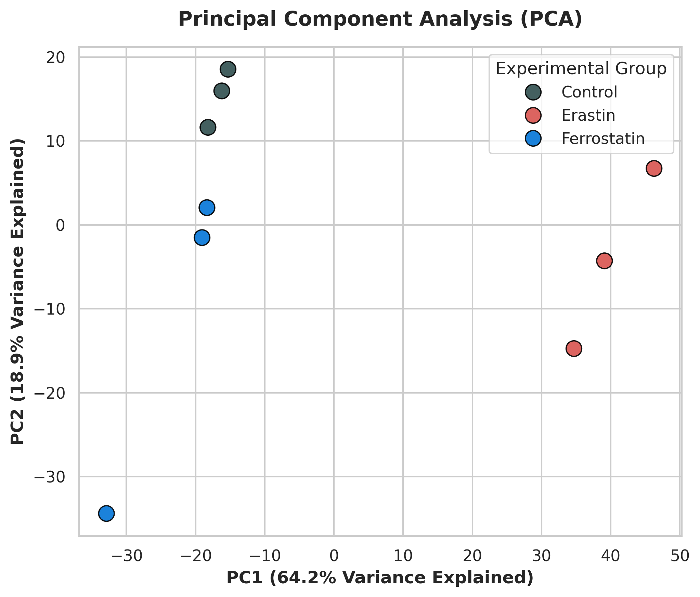
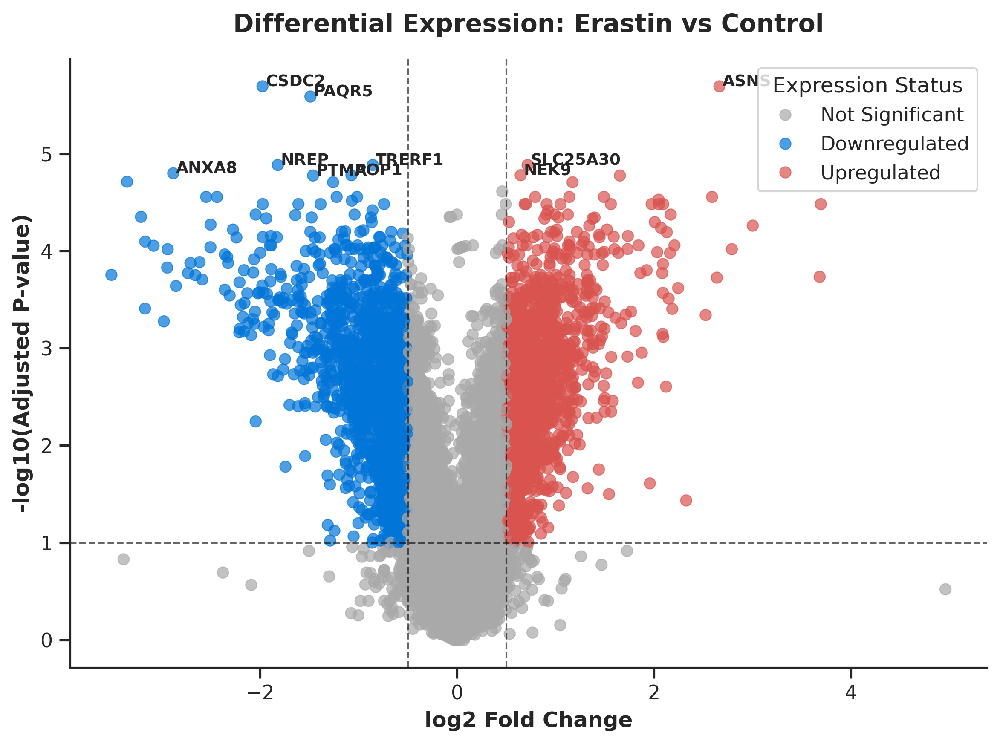
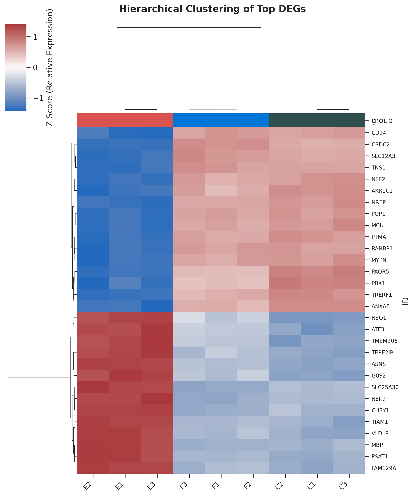

# 🧬 Ferroptosis Transcriptomic Analysis in HepG2 Cells



## Objective

To investigate transcriptional changes in HepG2 liver cancer cells following ferroptosis induction with Erastin and treatment with the ferroptosis inhibitor Ferrostatin, with a focus on oxidative stress, lipid metabolism, and ferroptosis-related biological processes.

## Dataset

**GEO accession:** GSE104462

The analysis included three experimental groups:

* **Control:** C1–C3
* **Erastin:** E1–E3
* **Ferrostatin:** F1–F3

The expression matrix was obtained from the Gene Expression Omnibus (GEO) and analyzed in Python.

## Analytical Workflow

**Expression matrix → preprocessing → PCA → differential expression → pathway enrichment → pre-ranked GSEA → biological interpretation**

## Tools

* Python
* Pandas
* NumPy
* Statsmodels
* Scikit-learn
* GSEApy
* Matplotlib
* Seaborn

---

# Analysis

## 1. Data Pre-processing

The expression matrix was loaded and gene identifiers were set as the index.

Expression values were transformed using:

```text
log2(x + 1)
```

A sample metadata table was constructed to assign each sample to its experimental group.

The transformed expression matrix was then used for downstream exploratory and differential expression analyses.

---

## 2. Principal Component Analysis

PCA was performed on the transformed expression matrix to examine global transcriptional differences between treatment groups.

The first two principal components were used to visualize sample-level clustering and assess whether treatment groups showed separation in their overall transcriptional profiles.

**Result:** ## 2. Principal Component Analysis

PCA was performed on the log2-transformed expression matrix to assess global transcriptional differences between the experimental groups.

The first two principal components explained **83.1% of the total variance**, with **PC1 accounting for 64.2%** and **PC2 accounting for 18.9%**.

* **PC1 (64.2%)** separated all three Erastin-treated samples from the Control and Ferrostatin samples.
* **PC2 (18.9%)** provided additional separation between Control and Ferrostatin samples.
* Control samples clustered relatively closely, while Ferrostatin showed greater within-group variation, including one sample that appeared separated from the other two Ferrostatin samples.
* The Erastin samples showed the largest overall transcriptional shift along PC1.

Together, these patterns indicate that **Erastin treatment is the dominant source of transcriptional variation in the dataset**, while Ferrostatin samples occupy the same general PC1 region as Control samples but retain some transcriptional differences.

The positioning of Ferrostatin relative to Erastin is **consistent with a partial shift away from the Erastin-associated transcriptional state**, but PCA alone does not establish a statistical rescue effect.

> **Interpretation:** PC1 (64.2% of variance) clearly separates Erastin-treated samples from Control and Ferrostatin samples, while PC2 (18.9%) provides additional separation between Control and Ferrostatin. Together, the two components explain 83.1% of the variance.


---

## 3. Differential Expression Analysis

Differential expression was assessed independently for:

* **Erastin vs Control**
* **Ferrostatin vs Control**

For each gene, an Ordinary Least Squares (OLS) model was fitted using Control as the reference group.

The analysis produced:

* log2 expression effect estimates
* p-values
* Benjamini–Hochberg adjusted p-values

For the Erastin analysis, genes were classified using:

* adjusted p-value < 0.10
* absolute log2 fold change > 0.5

### Erastin vs Control

| Metric            | Result |
| ----------------- | -----: |
| Genes analyzed    |    [N] |
| Significant genes |    [N] |
| Upregulated       |    [N] |
| Downregulated     |    [N] |

### Ferrostatin vs Control

| Metric            | Result |
| ----------------- | -----: |
| Genes analyzed    |    [N] |
| Significant genes |    [N] |
| Upregulated       |    [N] |
| Downregulated     |    [N] |

> The thresholds above reflect the thresholds used in the analysis notebook.



---

## 4. Expression Pattern Analysis

The 30 genes with the smallest adjusted p-values in the Erastin analysis were visualized using a hierarchical clustering heatmap.

Expression values were standardized by gene to show relative expression patterns across samples.

This analysis was used to assess whether the strongest transcriptional signals produced distinct expression patterns across Control, Erastin, and Ferrostatin samples.



---

## 5. Pathway Enrichment

Two complementary enrichment approaches were used.

### Enrichr

Genes meeting the Erastin significance thresholds were submitted to GSEApy's Enrichr interface using:

* KEGG 2021 Human
* GO Biological Process 2023
* Reactome 2022

This analysis identifies biological pathways overrepresented among the selected significant genes.

### Pre-ranked GSEA

A separate pre-ranked GSEA was performed using the full gene list ranked by the Erastin log2 fold-change estimate.

The same approach was also applied to the Ferrostatin ranking using KEGG and Reactome gene sets.

### Top enriched pathways

| Pathway     | NES | FDR |
| ----------- | --: | --: |
| [Pathway 1] | [X] | [X] |
| [Pathway 2] | [X] | [X] |
| [Pathway 3] | [X] | [X] |
| [Pathway 4] | [X] | [X] |
| [Pathway 5] | [X] | [X] |

---

# Key Findings

The analysis identified transcriptional differences between control and treatment conditions.

The Erastin-treated samples showed expression changes involving biological processes related to:

* oxidative stress
* glutathione metabolism
* lipid metabolism
* ferroptosis-associated processes

Ferrostatin produced a different transcriptional profile from Erastin, with the direction and magnitude of changes examined through differential expression and pathway-level analyses.

**Quantitative findings to be added after verification from the analysis outputs:**

* [N] genes met the Erastin significance thresholds.
* [N] genes were upregulated and [N] were downregulated.
* PC1 and PC2 explained [X]% and [Y]% of total variance.
* [Pathway] showed the strongest enrichment with NES [X] and FDR [X].
* [Specific biological observation supported by the enrichment results.]

## Biological Interpretation

The observed transcriptional changes are consistent with cellular responses associated with ferroptosis, particularly processes involving oxidative stress, glutathione metabolism, and lipid metabolism.

The contrasting profiles between Erastin and Ferrostatin provide evidence that the two treatments produced distinct transcriptional responses. However, a direct quantitative measure of reversal between Erastin and Ferrostatin was not calculated in this analysis, so the results are interpreted as **consistent with**, rather than definitive proof of, a transcriptional rescue effect.

---

# Limitations

* The analysis uses the available processed expression matrix rather than beginning from raw sequencing reads.
* The experiment contains a small number of samples per treatment group.
* OLS on log2-transformed expression values was used for differential expression rather than a count-based RNA-seq model.
* Pathway enrichment identifies statistical associations with biological processes but does not establish causal mechanisms.
* Additional validation would be required to determine whether individual candidate genes have functional roles in ferroptosis.
* A direct quantitative reversal analysis between Erastin and Ferrostatin was not performed.

---

# Reproducibility

The analysis notebook contains the complete workflow used to:

1. Load and transform the expression matrix
2. Construct sample metadata
3. Perform gene-wise OLS analysis
4. Apply multiple-testing correction
5. Generate differential expression results
6. Create PCA, volcano plot, and heatmap visualizations
7. Perform pathway enrichment and pre-ranked GSEA
8. Save analysis results and figures

## Output Structure

```text
results/
├── differential_expression.csv
├── significant_erastin.csv
└── significant_ferrostatin.csv

figures/
├── pca_plot.png
├── volcano_erastin.png
└── heatmap_top_DEGs.png
```

## Conclusion

This project applies statistical modeling, dimensionality reduction, differential expression analysis, visualization, and pathway-level analysis to investigate transcriptional responses to ferroptosis-related treatments in HepG2 cells.

The workflow demonstrates how public transcriptomic data can be used to move from gene-level expression measurements to pathway-level biological interpretation.
