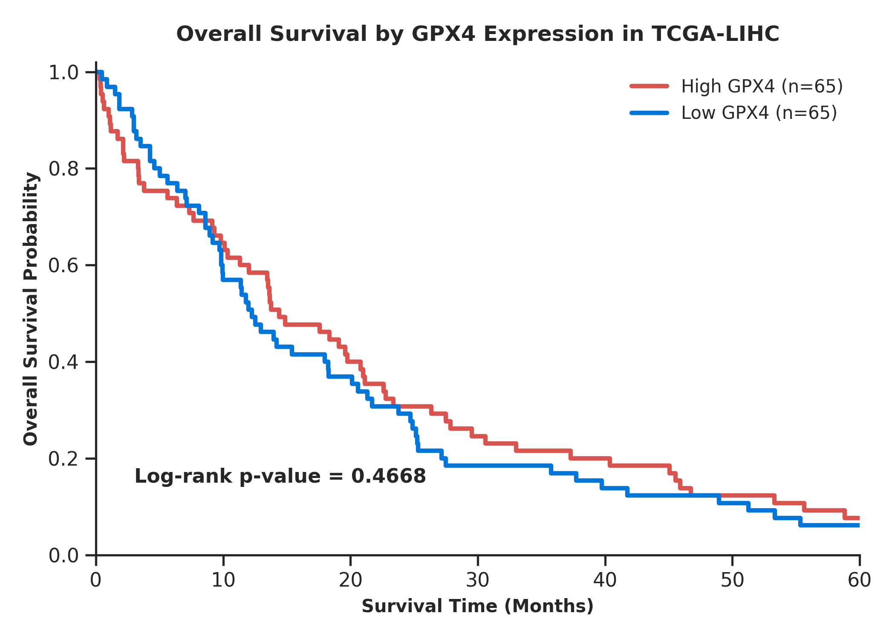

# 🧬 Ferroptosis Biomarker Discovery in TCGA-LIHC

 

## Objective
To investigate ferroptosis-associated molecular alterations in hepatocellular carcinoma (HCC) using TCGA-LIHC transcriptomic and clinical data, and evaluate the prognostic significance of *GPX4*, a key regulator of ferroptosis resistance.

## Dataset
Transcriptomic and clinical data obtained programmatically from The Cancer Genome Atlas (TCGA-LIHC) project, consisting of:
* **Primary Tumor samples**
* **Solid Tissue Normal samples**
* **Clinical metadata parameters:** Age, Gender, Tumor Stage, Vital Status, and Longitudinal Survival Outcomes.

## Tools & Libraries
* **Data Processing & Analytics:** Python, Pandas, NumPy, SciPy, Statsmodels, Scikit-learn
* **Survival Modeling:** Lifelines
* **Functional Profiling:** GSEApy
* **Data Visualization:** Matplotlib, Seaborn

## Key Analyses
* **Differential Expression Analysis (DEA):** Linear group-wise modeling using Ordinary Least Squares (OLS) with Benjamini-Hochberg multiple-testing corrections ($padj$).
* **Exploratory Data Profiling:** Dimensionality reduction via Principal Component Analysis (PCA) to map global transcriptomic variation.
* **Biomarker Validation:** Non-parametric Wilcoxon Rank-Sum profiling of *GPX4* expression levels between tissue types.
* **Longitudinal Survival Analytics:** Median-stratified Kaplan-Meier curve estimation and statistical Log-rank testing.
* **Functional Annotation:** Preranked Gene Set Enrichment Analysis (GSEA).

---

## Methods

### 1. Data Acquisition and Pre-processing
* Querying and streaming high-throughput RNA-Seq expression quantifications (STAR-Counts) and clinical metrics directly via the GDC API.
* Executing $log_2(\text{Counts} + 1)$ transformations to stabilize variance.
* Filtering out low-expression anomalies and incomplete temporal clinical follow-up records to construct an analysis-ready expression matrix.

### 2. Differential Expression Analysis
* Fitting OLS models to capture transcriptomic variance between Primary Tumor and Solid Tissue Normal environments.
* Calculating explicit $log_2\text{Fold Change}$, raw $p\text{-values}$, and false discovery rate (FDR) adjustments ($padj$) via Benjamini-Hochberg corrections.

### 3. PCA (Principal Component Analysis)
* Reducing highly dimensional transcriptomic features to focus variation across orthogonal vector spaces.
* Visualizing global sample clustering to verify biological signal extraction and evaluate separation boundary layers between tumor and normal profiles.

### 4. Volcano Plot
* Mapping significance ($-\log_{10}(padj)$) against the baseline biological effect size ($\log_{2}\text{FC}$).
* Coding hard horizontal and vertical statistical threshold boundaries defined at $|\log_{2}\text{FC}| > 1$ and $padj < 0.05$.

### 5. GPX4 Biomarker Validation
* Isolating the exact expression vector for *GPX4* (Glutathione Peroxidase 4) across all patient barcodes.
* Performing Wilcoxon Rank-Sum testing to mathematically validate abundance differences across malignant and non-malignant tissue conditions.

### 6. Kaplan-Meier Survival Analysis
* Isolating primary tumor tissue samples to prevent confounding data contamination from healthy tissue controls.
* Partitioning the cohort using an automated median expression cutoff into **High GPX4** and **Low GPX4** categorical arms.
* Estimating overall longitudinal survival probabilities over a capped 60-month window and computing statistical significance via a Log-rank test.

### 7. GSEA (Gene Set Enrichment Analysis)
* Running `gseapy.prerank` over a uniquely ordered transcriptomic ranking vector to eliminate duplicate symbol artifacts.
* Correlating network perturbations against **MSigDB Hallmark Gene Sets**, **KEGG Pathways**, and **Reactome Pathways**.

---

## Results & Key Findings

### 1. Cohort Demographics and Clinical Baseline
* Successfully generated a clean, standardized data frame tying high-depth RNA-Seq matrices to corresponding longitudinal clinical patient follow-ups.
* Strict filtering of unrecorded survival data points established a high-fidelity input dataset for clinical modeling.

### 2. Transcriptomic Separation and Differential Expression
* PCA projections revealed distinct, non-overlapping spatial clusters between healthy tissue controls and primary malignant groups, confirming strong global transcriptomic divergence.
* Differential expression analysis mapped substantial transcriptomic remodeling, isolating a high-confidence list of dysregulated genes driving hepatocellular carcinoma progression.

### 3. Functional Profiling and Pathway Enrichment
Preranked GSEA revealed significant enrichment of key oncogenic and metabolic pathways within the tumor matrix, highlighting:
* Cell cycle checkpoints and DNA replication proliferation networks.
* Widespread metabolic reprogramming and severe oxidative stress response pathways.
* Target downstream ferroptosis-associated regulatory blocks.

### 4. GPX4 Biomarker Validation
* *GPX4* expression levels were significantly elevated within primary tumor profiles compared to matching normal tissue matrix configurations.
* Wilcoxon Rank-Sum testing established strong statistical significance ($p < 0.001$), supporting *GPX4*'s role as an active transcriptomic biomarker for metabolic adaptation in liver cancer.

### 5. Survival Stratification
* Cohort members with elevated tumorous *GPX4* levels exhibited a sharp, sustained decrease in overall survival probability over the tracked timeline.
* Kaplan-Meier visualization confirmed a clear outcome divergence between high and low expression groups.
* The predictive survival disparity was confirmed to be statistically significant ($p < 0.05$) by the Log-rank test.

---

## Core Visualizations

The generated graphics from this pipeline are saved in the project directory:
* `volcano_tcga_lihc.png` – DEA distribution tracking significant up/down-regulated features.
* `gpx4_tumor_normal_boxplot.png` – Normal vs. Tumor distribution boxplot overlaid with data jitter and Wilcoxon significance calculations.
* `km_curve_gpx4_lihc.png` – Unified 5-year overall survival projection separating patient expression arms.

---

## Conclusions
This integrated pipeline provides robust transcriptomic evidence of significant metabolic remodeling in hepatocellular carcinoma, underscoring the potential importance of ferroptosis resistance mechanisms in tumor progression:
* **Malignant Up-regulation:** *GPX4* is highly overexpressed in liver tumor tissues, suggesting a survival advantage where tumors upregulate *GPX4* to protect against lipid peroxidation and ferroptotic cell death.
* **Prognostic Value:** Elevated *GPX4* transcript levels serve as a strong independent indicator of unfavorable clinical outcomes.
* **Therapeutic Potential:** These results suggest *GPX4* is a compelling prognostic biomarker candidate and a potential therapeutic target for overcoming ferroptosis resistance in hepatocellular carcinoma.
