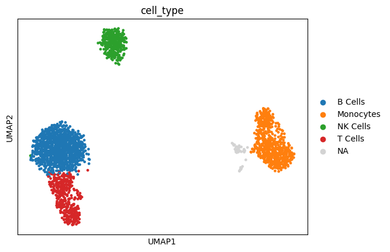

# 🧬 Single-Cell RNA-seq Analysis of Human PBMCs



This project contains an end-to-end Python pipeline using **Scanpy** to preprocess, cluster, and annotate a single-cell RNA sequencing (scRNA-seq) dataset of Human Peripheral Blood Mononuclear Cells (PBMCs).

---

## 🎯 Objective
To analyze scRNA-seq data from human PBMCs and identify distinct immune cell populations through quality control filtering, dimensionality reduction, unsupervised clustering, marker gene expression profiling, and cell-type annotation.

---

## 📊 Dataset
* **Source:** Publicly available 10x Genomics PBMC 3K single-cell dataset.
* **Dimensions:** 2,700 individual cells $\times$ 32,738 genes.
* **Composition:** Multiple circulating immune cell populations.

---

## 🛠️ Tools & Dependencies
The pipeline relies on the following Python libraries:
* **Single-Cell Analysis:** `scanpy`, `anndata`
* **Data Science & ML:** `numpy`, `pandas`, `scikit-learn`
* **Visualization:** `matplotlib`, `seaborn`
* **Clustering Engine:** `leidenalg`, `igraph`

---

## 🔄 Pipeline Workflow & Methods

### 1. Data Preprocessing & Quality Control
* Loaded the raw count matrix into an `AnnData` structure.
* Flagged mitochondrial genes using the `"MT-"` prefix to track dying or stressed cells.
* Calculated comprehensive quality control (QC) metrics via `sc.pp.calculate_qc_metrics`.
* Removed low-quality cells and doublets using strict threshold filtering:
  * **Gene counts:** Subsampled cells expressing $< 2,500$ genes.
  * **Mitochondrial fraction:** Excluded cells with $\ge 5\%$ mitochondrial read counts.

### 2. Normalization & Feature Selection
* Scaled library sizes to a target sum of $10^4$ reads per cell and log-transformed counts ($ln(counts + 1)$) to stabilize variance.
* Saved the normalized raw expression state to `adata.raw` for cleaner downstream marker testing.
* Subsampled the dataset to the top **2,000 highly variable genes (HVGs)** to focus on structurally informative biological variation.
* Regressed out unwanted variation and scaled expression matrix values to a maximum threshold of 10.

### 3. Dimensionality Reduction & Unsupervised Clustering
* Performed **Principal Component Analysis (PCA)** on the scaled HVG matrix to reduce data noise.
* Computed a neighborhood graph based on the top 40 principal components ($n_{\text{neighbors}} = 10$).
* Generated a two-dimensional **UMAP embedding** for low-dimensional layout visualization.
* Applied the **Leiden community detection algorithm** (resolution = 0.5) to capture transcriptionally distinct cell clusters.

### 4. Marker Gene Validation & Cell-Type Annotation
Clusters were mapped to explicit biological lineages using known canonical immune marker expression profiles:

| Cell Type | Canonical Marker Genes | Assigned Leiden Clusters |
| :--- | :--- | :--- |
| **T Cells** | `CD3D`, `CD8A` | Cluster 0 |
| **NK Cells** | `NKG7` | Cluster 1 |
| **B Cells** | `MS4A1` | Cluster 2 |
| **Monocytes** | `LYZ` | Cluster 3 |

### 5. Differential Marker Analysis
* Conducted a **Wilcoxon Rank-Sum test** comparing each cluster against all remaining cells to pinpoint cluster-specific signatures.
* Generated a hierarchical dendrogram and deep-dive expression **heatmap** for the top 5 differentially expressed markers per group to assess global cluster relationships.

---

## 📈 Key Code Snippets

### Preprocessing & Normalization
```
import scanpy as sc
```
# Load and annotate mitochondrial genes
```
adata = sc.datasets.pbmc3k()
adata.var["mt"] = adata.var_names.str.startswith("MT-")
sc.pp.calculate_qc_metrics(adata, qc_vars=["mt"], inplace=True)
```

### Filter, scale, and log-transform
```
adata = adata[adata.obs.n_genes_by_counts < 2500, :]
adata = adata[adata.obs.pct_counts_mt < 5, :]
sc.pp.normalize_total(adata, target_sum=1e4)
sc.pp.log1p(adata)
adata.raw = adata.copy()
```

### Highly Variable Genes selection and Scaling
```
sc.pp.highly_variable_genes(adata, n_top_genes=2000)
adata = adata[:, adata.var.highly_variable]
sc.pp.scale(adata, max_value=10)
```

### PCA, Neighbors, and UMAP
```
sc.tl.pca(adata, svd_solver="arpack")
sc.pp.neighbors(adata, n_neighbors=10, n_pcs=40)
sc.tl.umap(adata)
sc.tl.leiden(adata, resolution=0.5, flavor='igraph')
```

### Mapping clusters to immune types
```
celltype_map = {
    "0": "T Cells",
    "1": "NK Cells",
    "2": "B Cells",
    "3": "Monocytes"
}
adata.obs["cell_type"] = adata.obs["leiden"].map(celltype_map)
```

### Export processed object
```
adata.write("pbmc_scRNA_processed.h5ad")
```
---

# 📌 Results Summary

- Immune Cell Landscape: The unsupervised pipeline split the PBMC population into highly isolated, clean clusters representing standard circulating human immune cell subsets.

- Separation Quality: The UMAP layout showed strong partitioning between lymphoid (T, NK, B cells) and myeloid (Monocyte) lineages.

- Marker Fidelity: Cell-type mapping was directly corroborated by intense target localized expression of CD3D (T Cells), NKG7 (NK Cells), MS4A1 (B Cells), and LYZ (Monocytes) across the corresponding coordinates.

- Expression Specificity: Differential expression testing verified robust statistical enrichment for structural markers, showcasing clean data profiles matching contemporary single-cell reference atlases.
